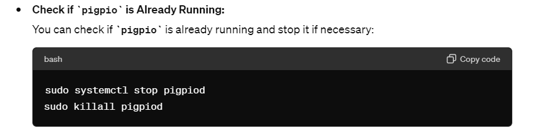
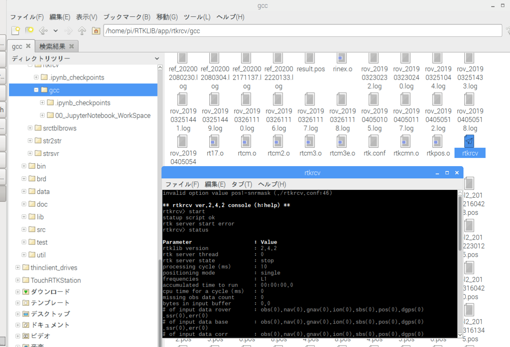

# 240513
## ラジコン自動運転の動作確認を行う
usage.pdfに従い、実行
sudo ./rtkrcv.sh

エラー

エラーの原因：pigpioのインストールができていないのかと思い、以下のリンクに従い、pigpioをインストールしてみる
https://karaage.hatenadiary.jp/entry/2017/02/10/073000

apt-get updateができない：OSのバージョンが古いのが原因のよう：[リンク](../common.md)

pidpioをインストールし、再度sudo ./rtkrcv.shを実行したが、同じエラー
apt-get install pigpio

# 240516
## 1つ目のエラー（pigpio）解消を進める

solution

`sudo systemctl stop pigpiod`
`sudo killall pigpiod`

→シェルスクリプトにも追加しておいた

# 240518
## 2つ目のエラー(pos1-snrmask)の解消を進める
[公式マニュアル](../common.md)ではconfig fileでpos1 -snrmaskではなく、pos1 -snrmask_L1などを定義している？

[既存システムでRTKLIB周りの作成時におそらく参考にされたリンク](https://qiita.com/KIT-tokunaga/items/f9a7249bdba8b1aceb3b)があった
ここではコメントアウトされている

[他のリンク](https://www.cqpub.co.jp/toragijr/article/2017/1704gnss.html)を見ると、旧バージョンの仕様のようで、コメントアウトされている。

→`pos1-snrmask`をコメントアウトして実行し、エラー解消

## rtkrcvの起動
エラー解消したが、rtkrcvが起動しない。以下のような状態になるはず。

gcc配下のrtkrcvを直接起動してみると、起動したが、startしてもエラーが出る。

→GPSのセンサーをラズパイにつなげていないからか？
→これで解決できそう？
https://github.com/tomojitakasu/RTKLIB/issues/412

シェルで確認する。
-sオプションをつけると起動しない。外すと起動する

オプションの意味を調査する。プログラムがスタートしたときにサーバが起動するという意味なので、startを押したのと同じ状態になるということ？

→これで解消できそう？
https://github.com/tomojitakasu/RTKLIB/issues/298

## pythonファイルも試してみる
色々エラーが出ている
initializeでgpsの接続エラーのようなもの

## 残課題
1. [rtkrcv server start error](#rtkrcvの起動)
2. [pythonファイル実行後のinitialize](#pythonファイルも試してみる)