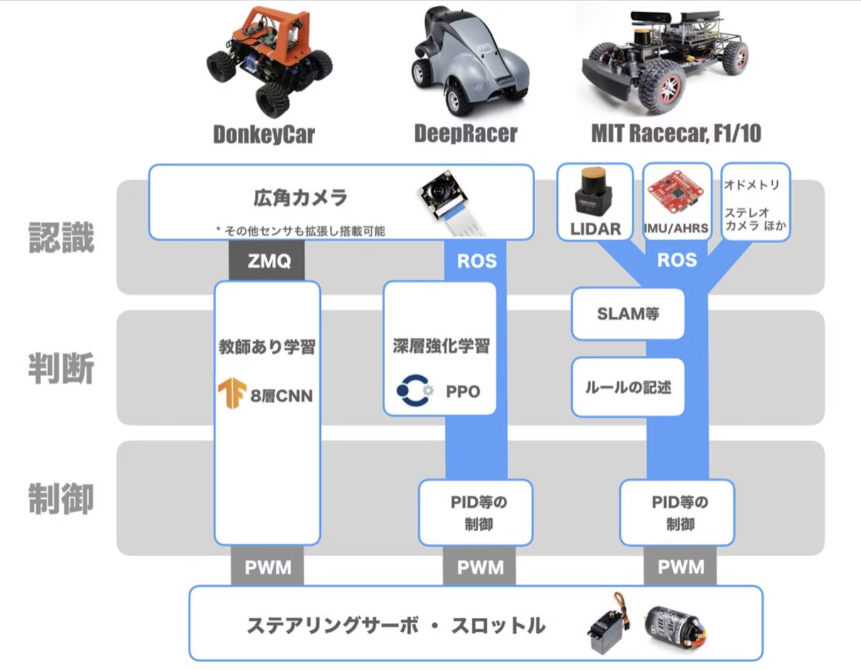
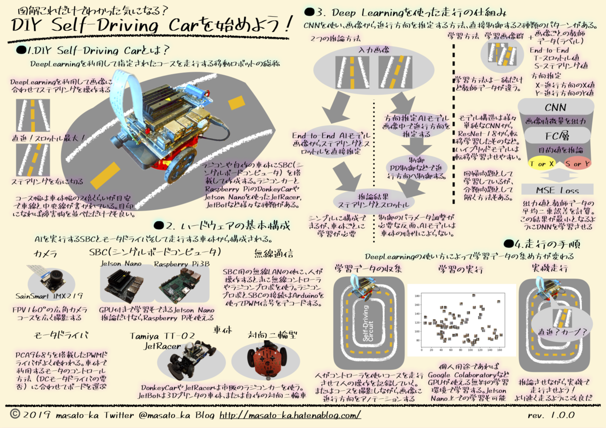
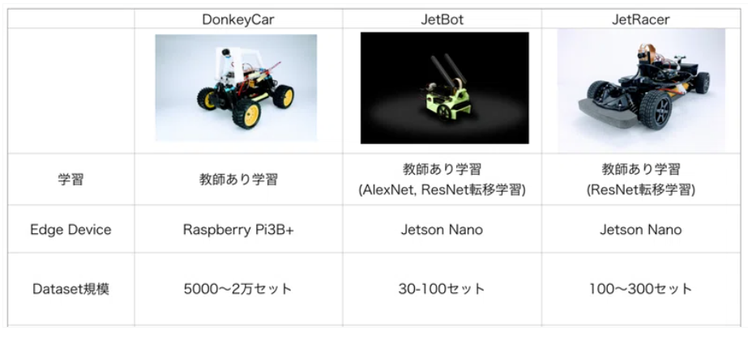

# 240606
## Pythonのテストコードで動作確認
home/pi/Documents/auto_rcのcar_io.py, main.py, controller.pyをhome/pi/murata_testに移動してテストを実施する

以下のように必要なsteer_test2()でステアリングとスロットルの動作確認を行うため、不要なコードはコメントアウトする

→ 動くことを確認した

# 240622
## AI RC Carの実現方法を調査
DonkeyCarやNvidiaのJetRacerが主流で、AIロジックを自作する人もいる
https://qiita.com/tomo_makes/items/f5532476e5e6d8c796c0
https://robotstart.info/2019/08/29/donkeycar-maker-tokyo.html

AI RC Carの仕組み
画像からステアとスロットルの出力を推論するEndToEndの方法と、画像から進行方向だけ推論してPID制御で走行させる方法の2つがある。
https://masato-ka.hatenablog.com/entry/2019/12/01/113553

DonkeyCarとJetRacerの違い
DonkeyCarはラズパイ、JetRacerはJetsonを使うのが一般的。JetRacerの方が学習データが少なくて済む
**→まずはラズパイを使うためDonkeyCarで進める**
https://note.com/gc_akira/n/n069a0a615871

Arduinoも使うことでカメラ以外のセンサデータを併用する例
https://qiita.com/arigadget/items/971afcd718b101242e3e

DonkeyCarの仕組み・作り方
https://qiita.com/hara2dev/items/1c2c30a93c7fb8e9861d

DonkeyCarの公式
https://www.donkeycar.com/