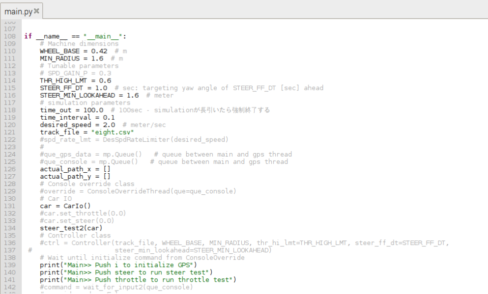

# 240606
## Pythonのテストコードで動作確認
home/pi/Documents/auto_rcのcar_io.py, main.py, controller.pyをhome/pi/murata_testに移動してテストを実施する

以下のように必要なsteer_test2()でステアリングとスロットルの動作確認を行うため、不要なコードはコメントアウトする

→ 動くことを確認した