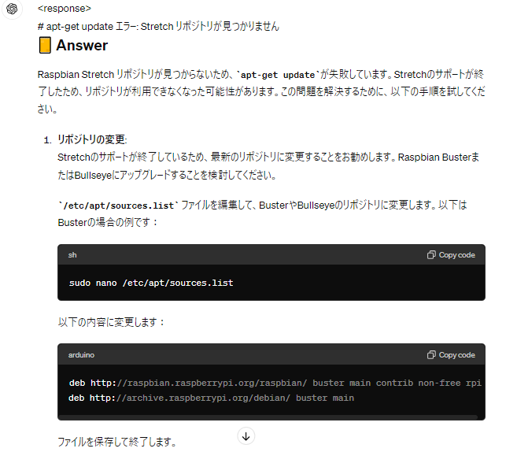

# 共通事項
## ラズパイとPCの接続
### ssh接続
* WiFi
ssh pi@192.168.173.208
* LAN
ssh pi@169.254.12.178
* or
ssh pi@raspberrypi.local

PW: raspberry

### VNCでリモートデスクトップ接続
IPアドレスか"raspberrypi.local"と入力して接続

## ラジコンの配線との接続
（system.pdfを参照）
黄線（TRUで2番の位置）：DCモータのPWM指令：ラズパイGPIO18
青線（TRUで1番の位置）：サーボモータのPWM指令：ラズパイGPIO19

## 参考資料
* [公式マニュアル](https://www.rtklib.com/prog/manual_2.4.2.pdf)

* [既存システムでRTKLIB周りの作成時におそらく参考にされたリンク](https://qiita.com/KIT-tokunaga/items/f9a7249bdba8b1aceb3b)

## 課題
ラズパイのOSバージョンがStrechで古いため、apt-get updateなどができない

そのためか、VSCodeのインストール、VSCodeのRemote SSHもできなかった。
→今後、カメラモジュールなど、新しい機能を追加する際にも問題になりそうなので、OSバージョンアップをしておきたい
